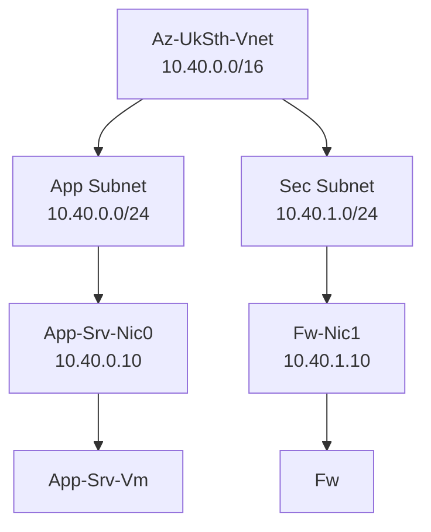

```mermaid
graph TD
    VNET["Az-UkSth-Vnet<br/>10.40.0.0/16"]

    VNET --> APP["App Subnet<br/>10.40.0.0/24"]
    VNET --> SEC["Sec Subnet<br/>10.40.1.0/24"]

    APP --> NIC1["App-Srv-Nic0<br/>10.40.0.10"]
    NIC1 --> VM1["App-Srv-Vm"]

    SEC --> NIC2["Fw-Nic1<br/>10.40.1.10"]
    NIC2 --> FW["Fw"]
```
